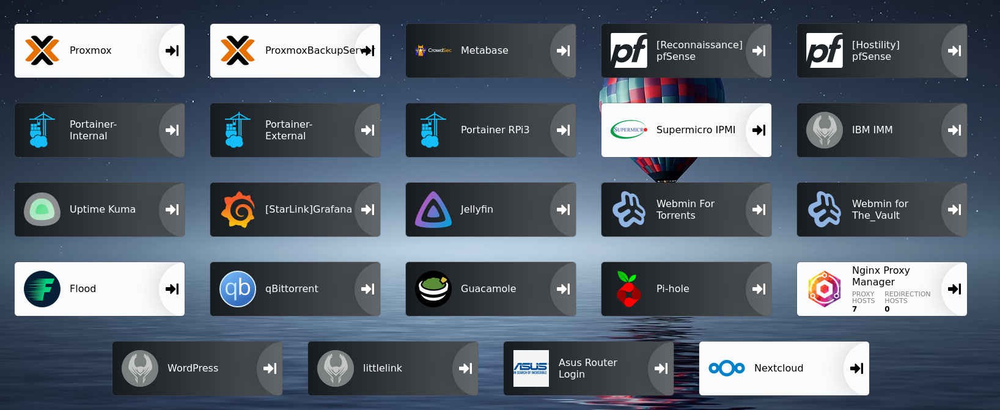

<!--
**The-Drobe/The-Drobe** is a ✨ _special_ ✨ repository because its `README.md` (this file) appears on your GitHub profile.

Here are some ideas to get you started:

- 🔭 I’m currently working on ...
- 🌱 I’m currently learning ...
- 👯 I’m looking to collaborate on ...
- 🤔 I’m looking for help with ...
- 💬 Ask me about ...
- 📫 How to reach me: ...
- 😄 Pronouns: ...
- ⚡ Fun fact: ...
-->

<h1 align="center">Hi , I am The-Drobe</h1>

I am currently a networking student at South Metro tafe in Perth Western Australia. I have a large interest in home labing, Linux and python development.

 
<h2 align="center">Skills</h2>
 
<!--https://github.com/tandpfun/skill-icons#readme-->

  

<h2 align="center">HomeLab</h2>

I host my services on a Proxmox cluster consisting of two servers and a Raspberry Pi3. These services are then hosted on a mix or virtual machines, Linux containers and Docker containers

<h2 align="center">What Am I Currently Doing?</h2>

I am currently configuring CrowdSec and Nginx Proxy Manger for intrusion detection and remediation.

 
<h1 align="center">Github Stuff</h1>

|  |  |
| --- | --- |
|  |  |

